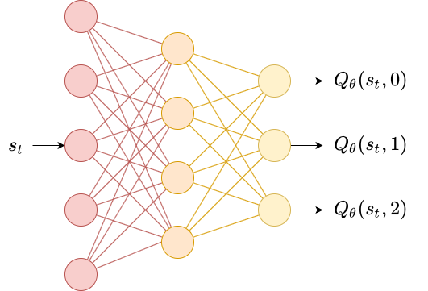
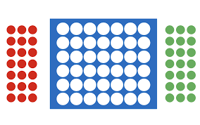

# DQN From Scratch

Welcome to **DQN From Scratch**! 🚀 This repository showcases my implementation of Deep Q-Learning from scratch. I've tested it on the classic CartPole environment and, in my humble opinion, it's better than the Stable Baselines' DQN. Additionally, I've built a Connect 4 environment using the Gym API, featuring a convolutional Q-network. Let's dive in!

## Repo Files

### 1. DQN

In this file, you'll find my custom DQN implementation, as well as a vanilla MLP Q-Network tested on the CartPole environment. Key highlights include:

- **Custom PyTorch Implementation**: Everything is handcrafted.
- **Training Scripts**: Code to train the DQN on the CartPole environment.

  

### Key Takeaways

One major lesson from this part was understanding how the performance plummets when using a rate scheduler with a big decay or rapid steps. Initially, with a 0.5 gamma, the model couldn't learn anything, leading to an 8-hour debugging session. My interpretation is that a high decay rate prevents the model from optimizing effectively after updating the target network. As training progresses, the model should pick up true Q-values, but with each target network update, the learning rate decreases, causing the model to "relearn" slowly.

### 2. Connect 4 DQN

You'll find my Connect 4 environment (connect.py), also featuring a Minimax Player coded from scratch, and a Q-network featuring a convolutional network (qnetconnect.py) with a kernel size of 4, together with a ConnectTrainer Wrapper Class implementing the Gymansium Env API. The intuition behind this CNN architecture is to discern those connected 4 patterns effectively. Key highlights include:

- **Custom Connect 4 Environment**: Built using Gym API.
- **Minimax Player**: For benchmarking and testing the agents.
- **Convolutional Q-Network**: Designed to learn patterns in the Connect 4 game.

  

### Performance Highlights

My custom DQN with the convolutional Q-network outperformed the MLP Policy DQN from Stable Baselines. Impressively, with just 200,000 steps against a random player, my DQN could hold its own against a minimax engine I coded with a search depth of 4. This confirms the intuition and effectiveness of the convolutional approach.

## What's next ?

In the future, stay tuned for more repositories where I'll implement AlphaZero and PPO algorithms from scratch for some rather unusual games.

